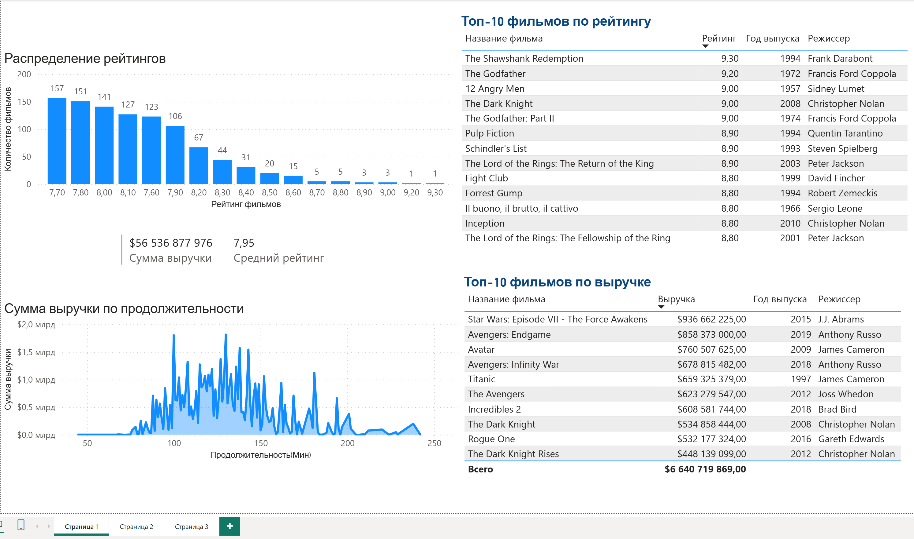
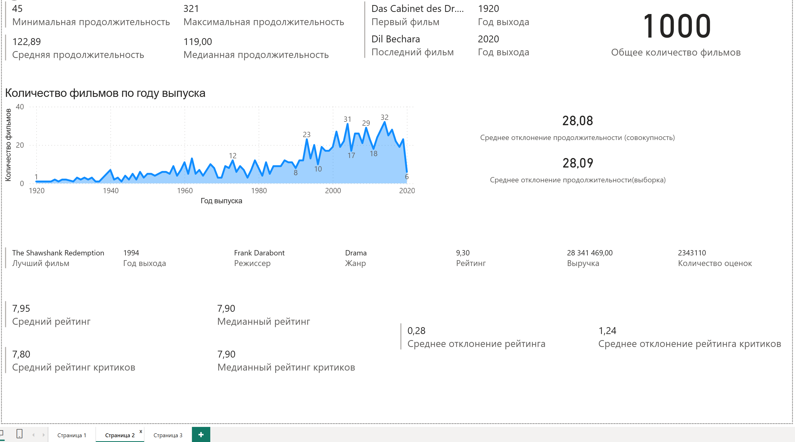
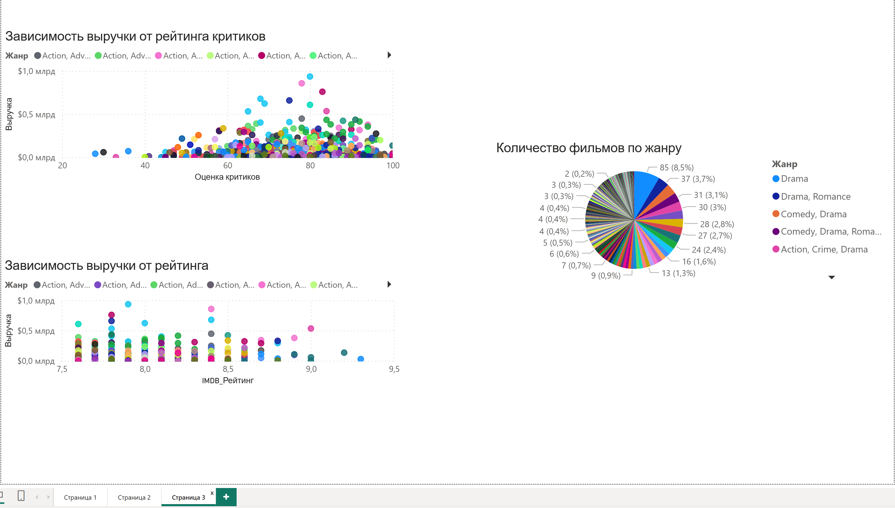

# IMDb-Top-1000-Movies-Analysis
Интерактивный дашборд для анализа 1000 лучших фильмов по версии IMDb. Проект визуализирует ключевые метрики кинематографа: рейтинги, финансовые показатели, статистические распределения, корреляции и взаимосвязь различных параметров фильмов.

## 📈 Страница 1: Общий анализ
### 🚀 Особенности
+ **Распределение рейтингов**

+ **Финансовый анализ**

+ **Рейтинговый анализ**

### 📈 Метрики и Визуализации
+ 📊 **Распределение рейтингов (Гистограмма)** - частота встречаемости оценок IMDb

+ 💰 **Сумма выручки по продолжительности (Диаграмма)** - динамика доходов в зависимости от хронометража

+ 🏆 **Топ-10 фильмов по рейтингу (Таблица)** - лучшие фильмы по оценкам

+ 💵 **Топ-10 фильмов по выручке (Таблица)** - самые кассовые фильмы

+ 📈 **Суммарная выручка (Карточка)** - общие кассовые сборы

+ ⭐ **Средний рейтинг фильмов (Карточка)** - средняя оценка по выборке

## 📊 Страница 2: Статистический анализ
### 🚀 Особенности
+ **Анализ продолжительности**

+ **Временной анализ**

+ **Детальная статистика рейтингов**

+ **Анализ отклонений**

### 📈 Метрики и Визуализации

📏 **Метрики продолжительности:**
+ **Минимальная продолжительность** - самый короткий фильм в выборке

+ **Максимальная продолжительность** - самый длинный фильм в выборке

+ **Средняя продолжительность** - средняя длительность фильмов

+ **Медианная продолжительность** - медианное значение длительности

### 📅 Временной анализ:
+ **Количество фильмов по году выпуска (График)** - распределение по годам

+ **Первый фильм** - название и год выпуска самого старого фильма в выборке

+ **Последний фильм** - название и год выпуска самого нового фильма в выборке

+ **Общее количество фильмов** - общее число фильмов в датасете

### 🎯 Анализ рейтингов:
+ **Лучший фильм** - детальная карточка с названием, годом выпуска, режиссером, жанром, рейтингом, выручкой и количеством оценок

+ **Средний рейтинг** - средняя оценка фильмов

+ **Медианный рейтинг** - медианная оценка фильмов

+ **Средний рейтинг критиков** - средняя оценка от критиков

+ **Медианный рейтинг критиков** - медианная оценка от критиков

### 📊 Статистические показатели:
+ **Среднее отклонение рейтинга** - стандартное отклонение оценок зрителей

+ **Среднее отклонение рейтинга критиков** - стандартное отклонение оценок критиков

+ **Среднее отклонение продолжительности** - стандартное отклонение длительности фильмов

## 🔗 Страница 3: Анализ зависимостей и распределений
### 🚀 Особенности
+ **Корреляционный анализ**

+ **Жанровая статистика**

+ **Визуализация взаимосвязей**

### 📈 Метрики и Визуализации
### 🔄 Корреляционный анализ:
+ **Зависимость выручки от рейтинга критиков (Точечная диаграмма)** - анализ связи между оценками критиков и коммерческим успехом

    ◌ **Ось X:** Рейтинг критиков

    ◌ **Ось Y:** Выручка фильма

    ◌ **Цвет точек:** Обозначает жанр
+ **Зависимость выручки от рейтинга IMDb (Точечная диаграмма)** - исследование влияния зрительских оценок на кассовые сборы

    ◌ **Ось X:** Рейтинг IMDb

    ◌ **Ось Y:** Выручка фильма

    ◌ **Цвет точек:** Обозначает жанр
  
### 🎭 Распределение по жанрам:
+ **Количество фильмов по жанру** (Круговая диаграмма) - визуализация жанрового распределения в топ-1000

    ◌ Процентное соотношение жанров

    ◌ Абсолютные значения количества фильмов по каждому жанру

    ◌ Интерактивная возможность выделения сегментов
  
### 🛠️ Технические детали
**Инструменты:**

+ Microsoft Power BI Desktop

+ DAX формулы для расчетов статистических показателей

+ Power Query для обработки и очистки данных

+ Статистические функции для анализа отклонений и корреляций

## 🔍 Ключевые инсайты из анализа IMDb Top 1000
### 🎭 О жанрах
+ **Драма доминирует** - самый популярный жанр в топе

+ **9 из 10** ведущих жанров содержат драматические элементы

+ **Жанровое смешение** - успешные фильмы часто сочетают несколько жанров

### ⏱️ О продолжительности
+ **Оптимум 130 минут** - фильмы такой длины собирают наибольшую выручку

+ **Рекорд длительности** - самый долгий фильм идет 5+ часов (321 минута)

### 📈 О рейтингах и выручке
+ **Рейтинг ≠ успех** - высокие оценки не гарантируют кассовые сборы

+ **Критики vs зрители** - мнение критиков слабо влияет на финансовый результат

+ **Золотая середина** - большинство топ-фильмов имеют рейтинг 7.7

### 📅 О временных трендах
+ **Пиковый год** - 2014 год стал рекордсменом по количеству топ-фильмов

+ **Золотая эра** - период 1993-2019 годов наиболее продуктивен

+ **Исторический разброс** - первый топ-фильм вышел в 1920, лучший по рейтингу - в 1994

### 💰 О финансовых показателях
+ **Максимальная выручка** - рекорд составляет $936 млн

+ **Неравенство доходов** - фильмы с одинаковым рейтингом могут иметь выручку, отличающуюся в 200 раз

**Главный вывод:** Успех фильма определяется сложным сочетанием факторов, где рейтинг и мнение критиков играют второстепенную роль по сравнению с другими параметрами.
